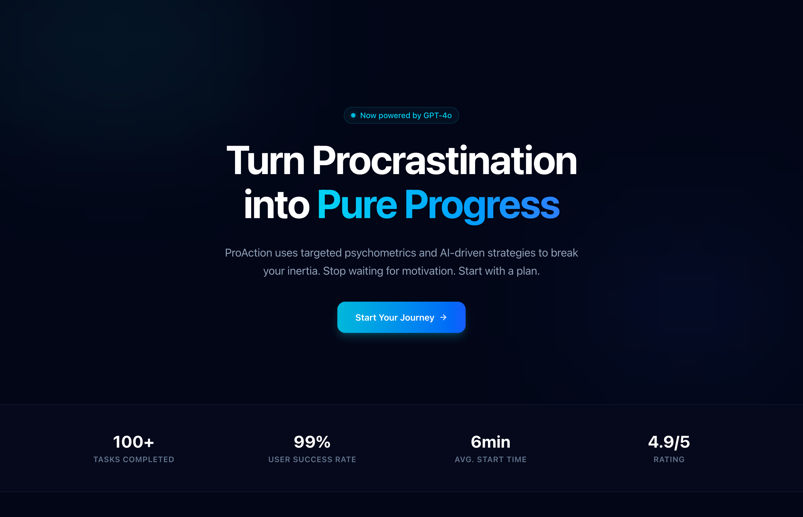

# ProAction ⚡  
**AI-powered anti-procrastination app that turns hesitation into action**

ProAction helps users break procrastination by generating a **clear, realistic next action** instead of motivation or generic productivity advice.

> You tell ProAction what you’re avoiding.  
> ProAction tells you exactly what to do next.

---

## ✨ Features

- 🔐 **Secure Authentication** via Clerk (Google / GitHub)
- 🧠 **AI-generated action plans** using GPT
- 🎯 Focus on **small, executable first steps**
- ⏱️ Plans tailored to user energy, time, and resistance
- ⚡ Minimal flow — no distractions, no fluff

## 🤖 AI Philosophy

ProAction does **not**:
- Motivate
- Shame
- Overplan
- Create long roadmaps

ProAction **does**:
- Reduce resistance
- Create momentum
- Focus on the next smallest step
- Assume low energy & high friction

---

## 🧠 Sample AI Output

**First Action**
> Open VS Code and create a blank `slides.md` file.

**15–30 Minute Plan**
1. Write slide titles only (10 min)  
2. Add one example per slide (10 min)  
3. Stop — no polishing (5 min)

**Reframe**
> You’re not finishing this — you’re proving you can start.

---

## 🛠 Tech Stack

### Frontend
- **Tanstack Start** (App Router)
- **Tailwind CSS**
- **shadcn/ui**

### Auth
- **Clerk**

### AI
- **OpenAI GPT**

### Backend
- Tanstack API Routes / Server Actions